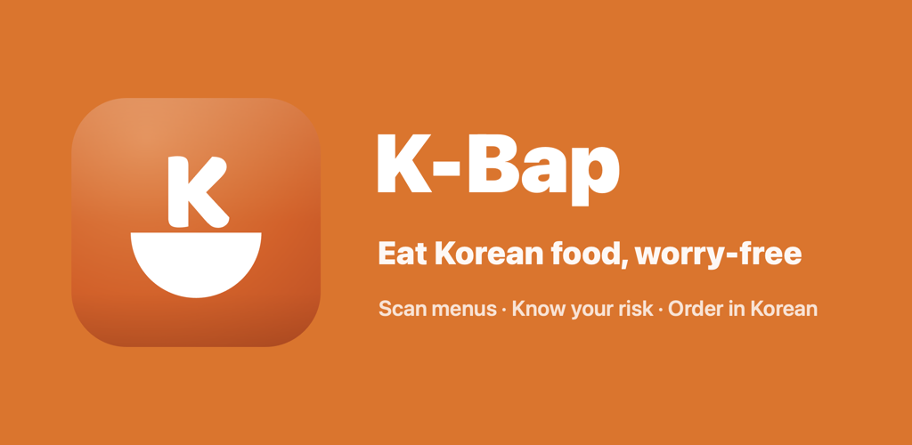
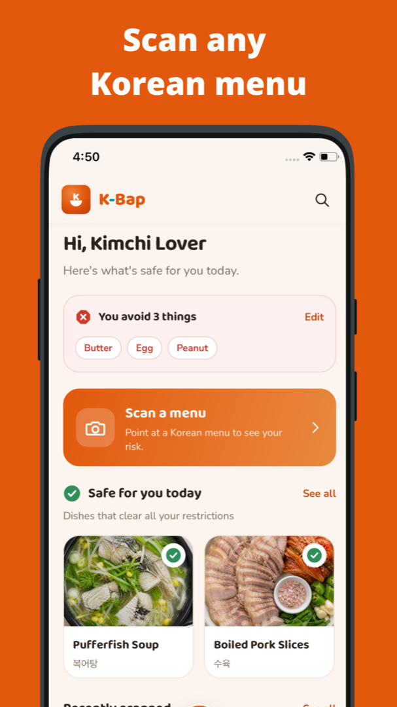
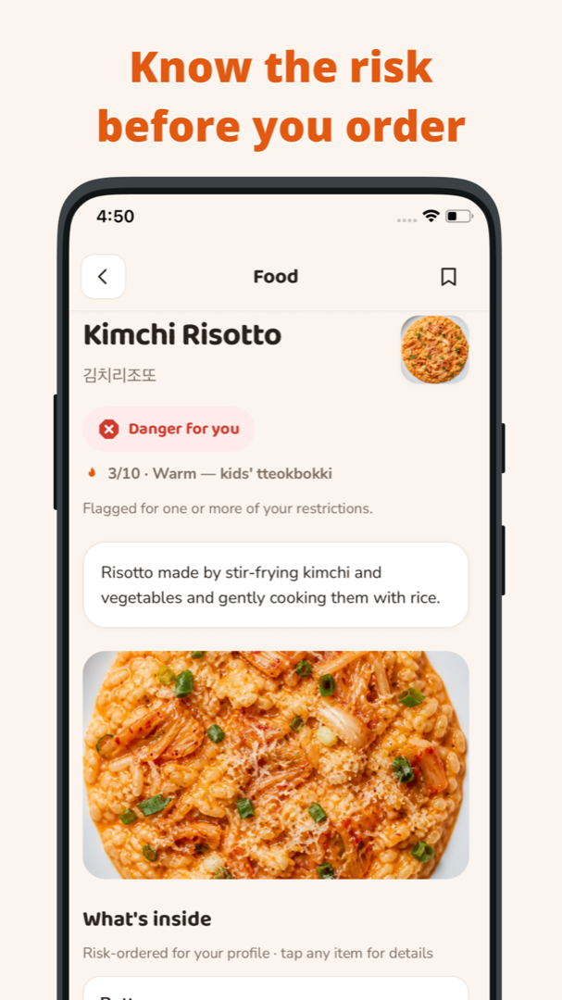
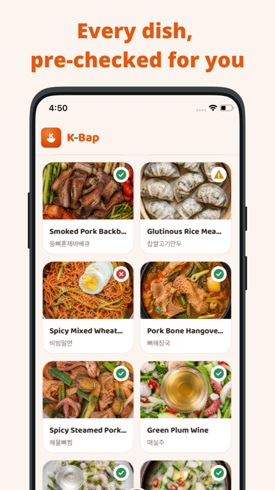
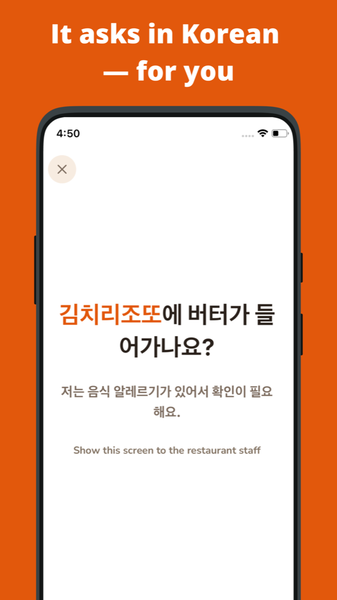

<!-- team-skyjs/.github/profile/README.md — English. 한국어: README.ko.md -->

**English** · [한국어](./README.ko.md)

  

  
  &nbsp;
  

  <b>iOS</b> on the App Store · <b>Android</b> rolling out on Google Play · Project board: <a href="https://simhani1.atlassian.net/jira/software/projects/KB/boards/2">Jira KB</a> (team members only)

---

# skyjs

We are a two-person team building **K-Bap**, a Korean food safety guide for people who can't read a Korean menu but need to know what's safe for them to eat.

| | Role | GitHub |
|---|---|---|
| **Yejin Kim** | Product · mobile (React Native) · backend · design integration | [@rocher71](https://github.com/rocher71) |
| **Jonghan Sim** | Backend · infrastructure · data pipeline | [@simhani1](https://github.com/simhani1) |

---

## K-Bap

> Scan any Korean menu. See what's safe for *you* before you order.

Korean menus rarely list ingredients, and staff often can't explain them in English. K-Bap closes that gap for travelers and residents with allergies, dietary rules (vegan, halal, kosher, gluten-free …) and spice limits.

  
  
  
  

**What it does**

- **Scan a menu** — point the camera at a Korean menu; dishes are recognized and matched to our curated food database.
- **Personal risk verdict** — every dish is rated Safe / Caution / Danger / Unable to assess against the ingredients you avoid, with the reason shown.
- **Ingredients, explained** — what's inside each dish, how often an ingredient appears across restaurants, and translated names.
- **Ask the owner** — a one-tap Korean card you show to staff: "Does this contain X? I have a food allergy."
- **Reviews from travelers like you** — ratings and notes, filterable by your own nationality.
- **Order history & reminders** — keep what you ordered and get a nudge to review it later.

10 UI languages: English, 한국어, 中文(简体·繁體), 日本語, Español, Русский, Tiếng Việt, Bahasa Indonesia, ไทย.

---

## Repositories

| Repo | What it is | Stack |
|---|---|---|
| [kbap-fe](https://github.com/team-skyjs/kbap-fe) | Mobile app | React Native · Expo · TypeScript |
| [kbap-server](https://github.com/team-skyjs/kbap-server) | API server | Kotlin · Spring Boot · MySQL · AWS |
| [kbap-image-maker](https://github.com/team-skyjs/kbap-image-maker) | Dish image generation pipeline | Python |
| [kbap-langchain](https://github.com/team-skyjs/kbap-langchain) | LLM experiments for menu understanding | Python |
| [kbap-legal](https://github.com/team-skyjs/kbap-legal) | Privacy policy, terms, safety notice | Static site |
| [kbap-study](https://github.com/team-skyjs/kbap-study) | Server-side study notes | — |

Specs, the admin console and internal tooling live in private repositories.

---

## Stack & tools

**Mobile app (kbap-fe)**
- React Native 0.85 · Expo · expo-router · TypeScript
- TanStack Query · Reanimated · react-native-svg · i18next (10 languages)
- Firebase Auth (Sign in with Apple / Google) · ML Kit text recognition (on-device OCR) · expo-camera · expo-notifications (local reminders) · expo-secure-store
- Sentry · Amplitude
- EAS Build / EAS Update (OTA, teamtest·production channels) / EAS Workflows (auto OTA CI) / EAS Submit · TestFlight · Jest

**Backend (kbap-server)**
- Kotlin · Spring Boot · Gradle multi-module (api · batch · common)
- MySQL (JPA + Flyway) · Redis (refresh-token rotation, scan reservations) · JWT
- Firebase Admin (token verification, account deletion) · AWS S3 (images, presigned upload) · S3 Vectors (food embeddings) · SQS (batch pipeline)
- OpenAI (gpt-4o-mini, text-embedding-3-small, gpt-image-2) · Google Places / Geocoding · Frankfurter (FX rates)
- Langfuse (LLM observability) · Micrometer + Prometheus + Grafana · k6 + JFR load testing · Docker

**Infrastructure**
- AWS ECS + ALB + CloudWatch + SSM Parameter Store + Route 53 · Terraform
- GitHub Actions (build, dev/prod canary deploys)

**Content pipeline**
- kbap-langchain: LangGraph / LangChain (OpenAI + Google Gemini) · Langfuse · SQS consumer · Python (uv)
- kbap-image-maker: OpenAI Images API (gpt-image-2) · Python

**Admin (kbap-admin)**
- React · Vite · TypeScript · TanStack Router / Query / Table · Tailwind + shadcn/Radix · Cloudflare Pages

**Design**
- Figma (designer handoff) · Claude Design (early direction) · Baloo 2 (brand font, Google Fonts)

**Collaboration & operations**
- Jira (KB) · GitHub (org, branch rulesets) · OpenAI Codex (automated PR review) · Claude Code (command center, FE and BE sessions, spec-kit)
- App Store Connect · Google Play Console · Firebase console · Proxyman (network QA)

---

## How we work

- Jira for tasks, GitHub PRs with AI-assisted code review, and a spec repository as the single source of truth for product decisions.
- Safety first: a dish is never shown as "safe" unless we can verify it. When we can't, we say so and point you to the owner.

_Safety information in K-Bap is guidance, not medical advice. Always confirm with the restaurant._
